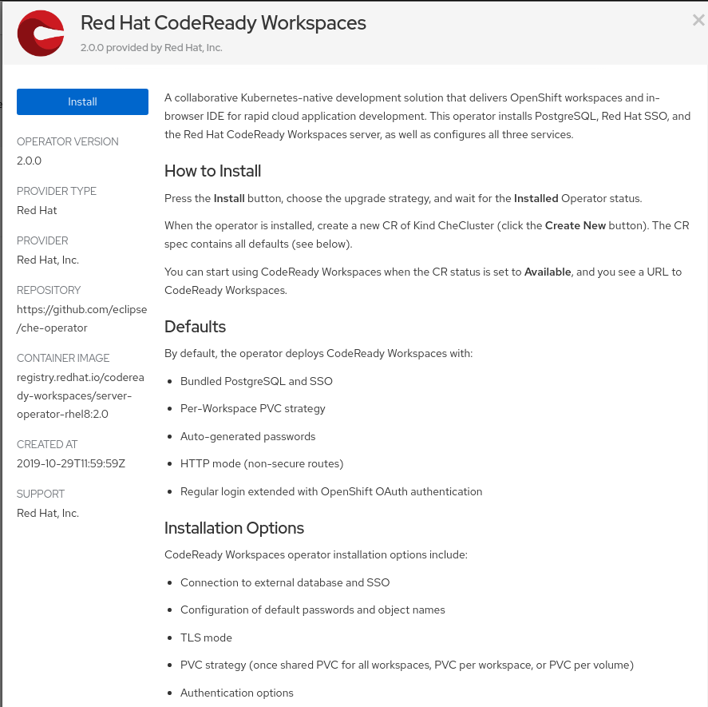
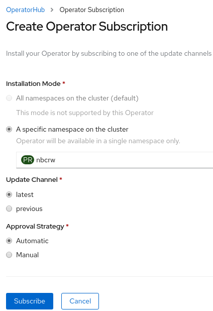
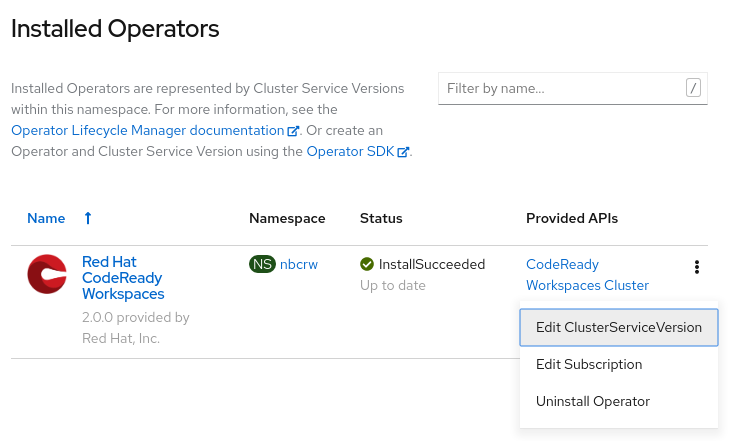
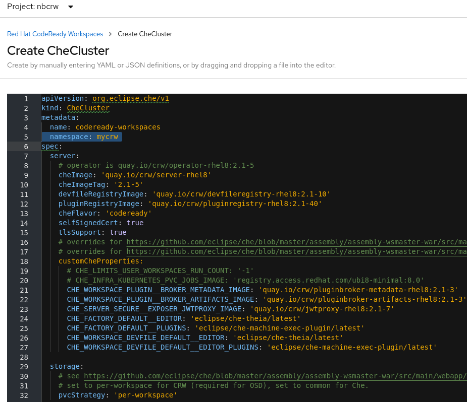
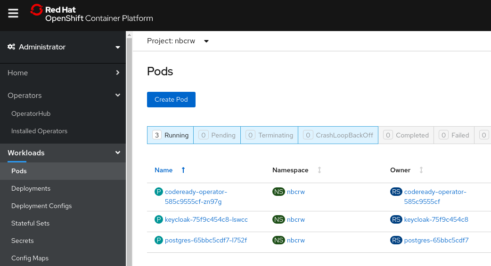
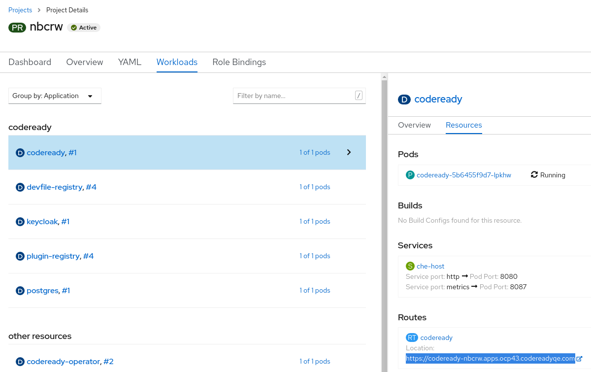
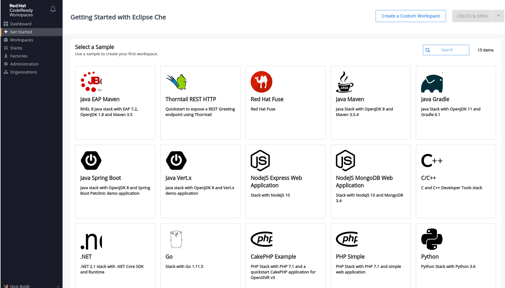

1. Log in to the cluster via commandline.

2. Create an empty project namespace into which to install CodeReady Workspaces 2.1
+
  oc create namespace mycrw
  oc project mycrw

3. Browse to your cluster and find the ``Workspaces`` operator under ``Operators > OperatorHub``.
+
https://console-openshift-console.apps.ocp43.codereadyqe.com/operatorhub/ns/mycrw?keyword=workspaces&details-item=codeready-workspaces-redhat-operators-openshift-marketplace

4. Click the ``Install`` button to install it into your namespace.
+
link:images/01_install-operator.png[]
+
Then ``Subscribe`` to the latest channel.
+
link:images/02_subcribe.png[]

5. You can now manually edit the CSV to point it at the CRW 2.1 operator ( ``link:https://quay.io/crw/operator-rhel8:latest[quay.io/crw/operator-rhel8:latest]`` )...
+
link:images/03_edit-csv.png[]
+
Or run this on the commandline to patch it:

    #check CSV for container image references to CRW
    oc get csv -o yaml | yq '.items[0].metadata.annotations.containerImage'; oc get csv -o yaml | yq '.items[0].spec.install.spec.deployments[0].spec.template.spec.containers[0].image'

    # replace CRW 2.0 operator with CRW 2.1
    oc get csv -o json > config.json
    sed -e "s#registry.redhat.io/codeready-workspaces/crw-2-rhel8-operator:2.1#quay.io/crw/operator-rhel8:latest#" -i config.json && oc replace -f config.json

    #check if fixed
    oc get csv -o yaml | yq '.items[0].metadata.annotations.containerImage'
    oc get csv -o yaml | yq '.items[0].spec.install.spec.deployments[0].spec.template.spec.containers[0].image'

6. Next, explore your ``Installed Operator``'s details and select the ``CodeReady Workspaces Cluster`` tab, then add a custom resource based on one of these using the blue Create CheCluster button:
+
  https://github.com/nickboldt/codeready-workspaces-chectl/blob/2.1-x/docs/custom-resource.yaml
  https://github.com/nickboldt/codeready-workspaces-chectl/blob/2.1-x/docs/custom-resource-minimal.yaml
+
NOTE: if pasting from another custom-resource.yaml file directly, make sure you don't overwrite or delete the metadata.namespace entry on line 5:
+
  metadata:
    namespace: mycrw
+
link:images/04_customresource_checluster.png[]

7. Click the ``Create`` button.

8. Go to the ``Workloads > Pods`` section to see the pods starting up.
+
link:images/05_workloads-pods.png[]

9. Once the registries are deployed and their pods have loaded, you'll need to patch them so they will pull CRW 2.1 nightly images from Quay instead of the older, but stable CRW 2.0 images from the Red Hat Container Catalog:
+
  oc set env deployment/plugin-registry CHE_SIDECAR_CONTAINERS_REGISTRY_URL=quay.io
  oc set env deployment/plugin-registry CHE_SIDECAR_CONTAINERS_REGISTRY_ORGANIZATION=crw
  oc set env deployment/plugin-registry CHE_SIDECAR_CONTAINERS_REGISTRY_TAG=2.1

  oc set env deployment/devfile-registry CHE_DEVFILE_IMAGES_REGISTRY_URL=quay.io
  oc set env deployment/devfile-registry CHE_DEVFILE_IMAGES_REGISTRY_ORGANIZATION=crw
  oc set env deployment/devfile-registry CHE_DEVFILE_IMAGES_REGISTRY_TAG=2.1

10. Browse to ``Home > Projects``, and find your project. Click on the ``Workloads`` tab. If the above step completed, you should see the registries are on their 4th rollout.
+
Then select the ``codeready`` server deployment. On the right-hand panel, under the ``Resources`` tab, you can see the ``route`` (URL) for your ``CodeReady Workspaces`` instance. Click it to open.
+
link:images/06_home-projects-project-workloads-codeready-resources-route-URL.png[]
+
NOTE: you can also find this route under ``Networking > Routes``.

11. You may be promoted to grant access, when logging into the deployment for hte first time. Accept and continue.

12. Create a user (or update an existing one) and log in.

13. You should now be able to launch a workspace from a devfile.

link:images/07_choose-devfile.png[]

[NOTE]
====
You may have to edit devfiles to point them at the correct container image, if you missed the registry patching step above.

``image: 'quay.io/crw/stacks-node-rhel8:2.1'``

vs.

``image: 'registry.redhat.io/codeready-workspaces/stacks-node-rhel8:2.1'``
====

