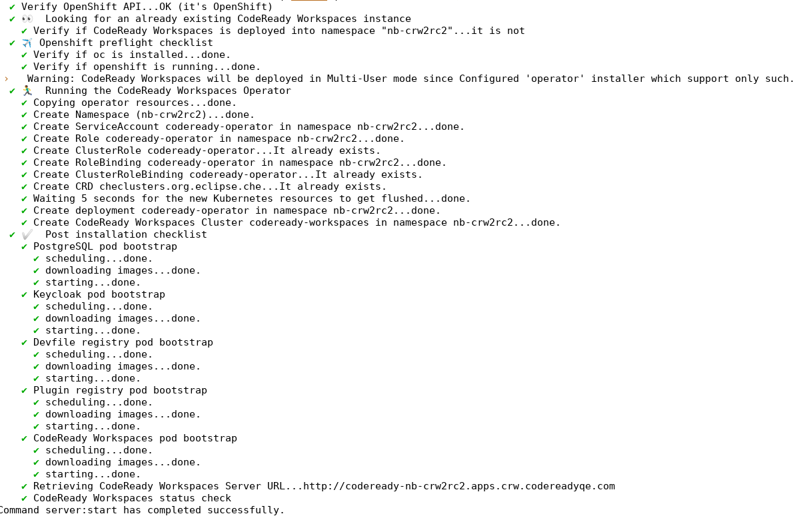
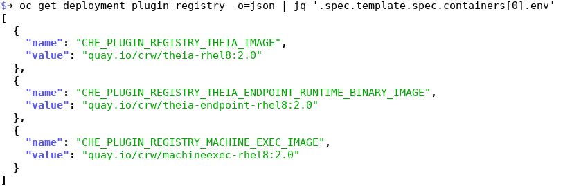
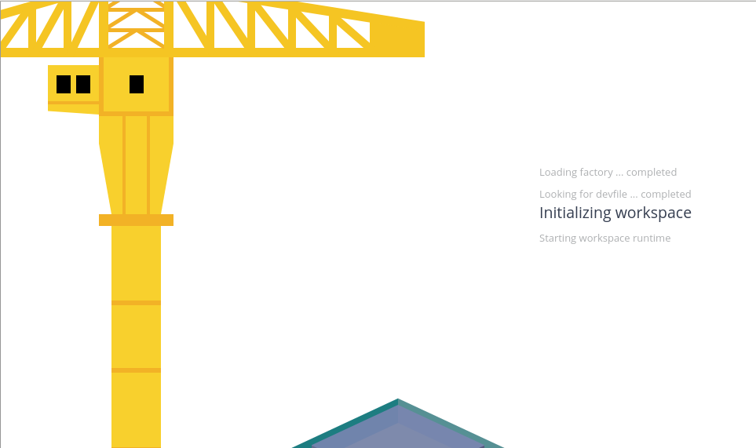
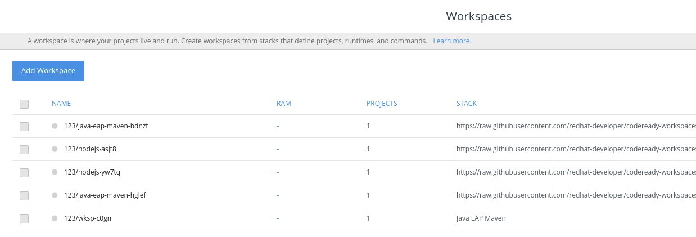
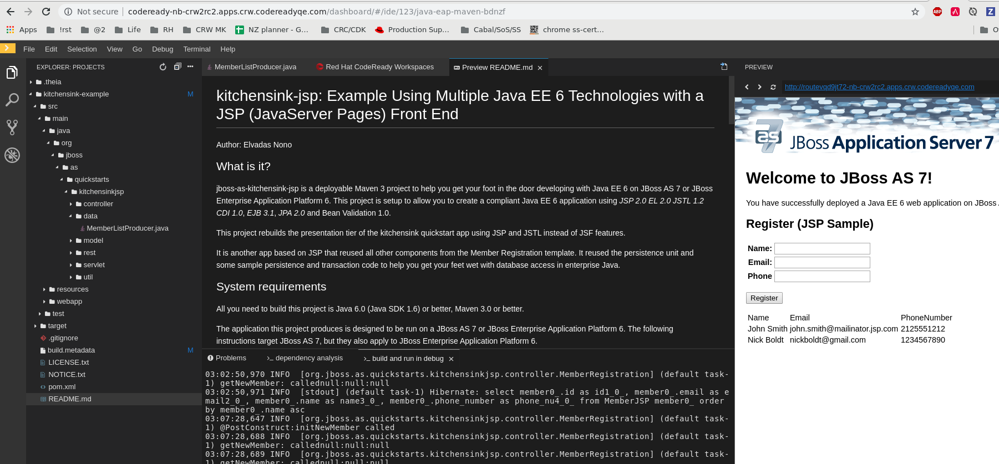

= Red Hat CodeReady Workspaces CLI README

Red Hat CodeReady Workspaces CLI


== About CodeReady Workspaces

See product _Release Notes and Known Issues_ for more information about the product and the current version:

https://access.redhat.com/documentation/en-us/red_hat_codeready_workspaces/2.0/html/release_notes_and_known_issues/


== Installing CodeReady Workspaces

See the CodeReady Workspaces _Administration Guide_ for instructions on how to deploy the product using various configurations and on different flavors of the OpenShift platform. The _Administration Guide_ includes instructions on how to:

* deploy with different parameters on Red Hat OpenShift Container Platform 3.11
* deploy on Red Hat OpenShift Container Platform 4.x
* deploy on Red Hat OpenShift Dedicated
* deploy on Red Hat OpenShift Container Platform in a restricted environment
* migrate from the previous version of the product
* uninstall the product

https://access.redhat.com/documentation/en-us/red_hat_codeready_workspaces/2.0/html/administration_guide/

== Installing with OperatorHub

On Openshift 4.x, the recommended way to install Workspaces is via OperatorHub. See link:https://access.redhat.com/documentation/en-us/red_hat_codeready_workspaces/2.0/html-single/installation_guide/index#installing-codeready-workspaces-on-openshift-4-from-operatorhub_installing-codeready-workspaces-on-openshift-container-platform-4[Installing CodeReady Workspaces on OpenShift 4 from OperatorHub].

However, the instructions below should also work, as crwctl is the recommended solution for installing Workspaces to an airgapped (restricted) environment, or for offline installs.

== Installing with crwctl

To install Workspaces 2.0 with crwctl:

* Download the latest crwctl from https://github.com/redhat-developer/codeready-workspaces-chectl/releases and install it
* using link:custom-resource.yaml[custom-resource.yaml] in this folder, deploy Workspaces as follows:

```
# log in to OCP 4 (or Minishift or CRC)
oc login ${OPENSHIFT_API_URL} -u ${OPENSHIFT_USERNAME} -p ${OPENSHIFT_PASSWORD} ...

# run deployment using default CRW images
/path/to/crwctl server:start -n crw2defaults
```

Note: if using Minishift, you might have to pre-pull images if your Minishift can't properly authenticate with the registry.

```
# pull images from registry.redhat.io as minishift cannot use authentication secret correctly 
eval $(minishift docker-env)
docker pull registry.redhat.io/rhscl/postgresql-96-rhel7:1-47
docker pull registry.redhat.io/redhat-sso-7/sso73-openshift:1.0-13.1567588155
...
```

== Overriding default images when deploying

If you need to swap out a default image for a custom one, eg., for testing a change, you can do so in three ways.


=== Override operator and default images

```
# run deployment using custom-resource.yaml to override Che defaults with CRW defaults
/path/to/crwctl server:deploy -n crw2custom \
  --che-operator-image=quay.io/crw/crw-2-rhel8-operator:latest \
  --che-operator-cr-yaml=custom-resource.yaml 
```




=== Override CRW containers in the plugin registry

Once installed via crwctl, you can override the link:https://github.com/redhat-developer/codeready-workspaces/tree/master/dependencies/che-plugin-registry/v3/plugins/eclipse[default CRW containers referenced in the plugin registry] using these specific environment variables:

```
QP="quay.io/crw"
QS="rhel8:latest"
for e in \
  THEIA_IMAGE=${QP}/theia \
  THEIA_ENDPOINT_RUNTIME_BINARY_IMAGE=${QP}/theia-endpoint \
  MACHINE_EXEC_IMAGE=${QP}/machineexec; do
    oc set env deployment/plugin-registry CHE_PLUGIN_REGISTRY_${e}-${QS};
done

# verify it worked
oc get deployment plugin-registry -o=json | jq '.spec.template.spec.containers[0].env'
```



=== Override ALL containers in the plugin registry

Alternatively, you an override ALL images used by plugins using these global environment variables:

```
for e in \
  URL=quay.io \
  ORGANIZATION=crw \
  TAG=latest; do
    oc set env deployment/plugin-registry CHE_SIDECAR_CONTAINERS_REGISTRY_${e};
done

# verify it worked
oc get deployment plugin-registry -o=json | jq '.spec.template.spec.containers[0].env'
```

This override mechanism is also in support of airgapped environments, where the CRW images are provided from a different `URL` and/or `ORGANIZATION`.


=== Override CRW container(s) in a customized devfile

Next, to launch a workspace using custom stack or plugin sidecar images, you need to override the link:https://github.com/redhat-developer/codeready-workspaces/tree/master/dependencies/che-devfile-registry/devfiles[default CRW containers referenced in the devfiles registry]. 

Here are two examples:

* Java - link:https://github.com/redhat-developer/codeready-workspaces/tree/master/dependencies/che-devfile-registry/devfiles/00_java-eap-maven/devfile.yaml[original] - link:devfiles/00_java-eap-maven/devfile.yaml[modified]
* Node - link:https://github.com/redhat-developer/codeready-workspaces/tree/master/dependencies/che-devfile-registry/devfiles/03_web-nodejs-simple/devfile.yaml[original] - link:devfiles/03_web-nodejs-simple/devfile.yaml[modified]

Once you have your devfile, you can open it in CRW using your installation's factory URL. Open your CodeReady Workspaces installation, and in place of the `/dashboard/` part of the URL, append `/f?url=` then the full *raw* URL of your devfile to load it.

`https://codeready-${OPENSHIFT_PROJECT}.${OPENSHIFT_INSTANCE}/f?url=https://raw.githubusercontent.com/redhat-developer/codeready-workspaces-deprecated/master/operator-installer/devfiles/00_java-eap-maven/devfile.yaml`



Note: The factory page may not directly load your workspace. If that happens, just go back to your `/dashboard/` URL and you'll see your new workspace in the list of available ones. Click on it to start it up. 



Once your workspace loads, you should see something like this. You can run the sample app from the `Terminal` menu.




=== Override ALL containers in the devfile registry

Alternatively, you an override ALL images used by devfiles using these global environment variables:

```
for e in \
  URL=quay.io \
  ORGANIZATION=crw \
  TAG=latest; do
    oc set env deployment/devfile-registry CHE_DEVFILE_IMAGES_REGISTRY_${e};
done

# verify it worked
oc get deployment devfile-registry -o=json | jq '.spec.template.spec.containers[0].env'
```

This override mechanism is also in support of airgapped environments, where the CRW images are provided from a different `URL` and/or `ORGANIZATION`.
